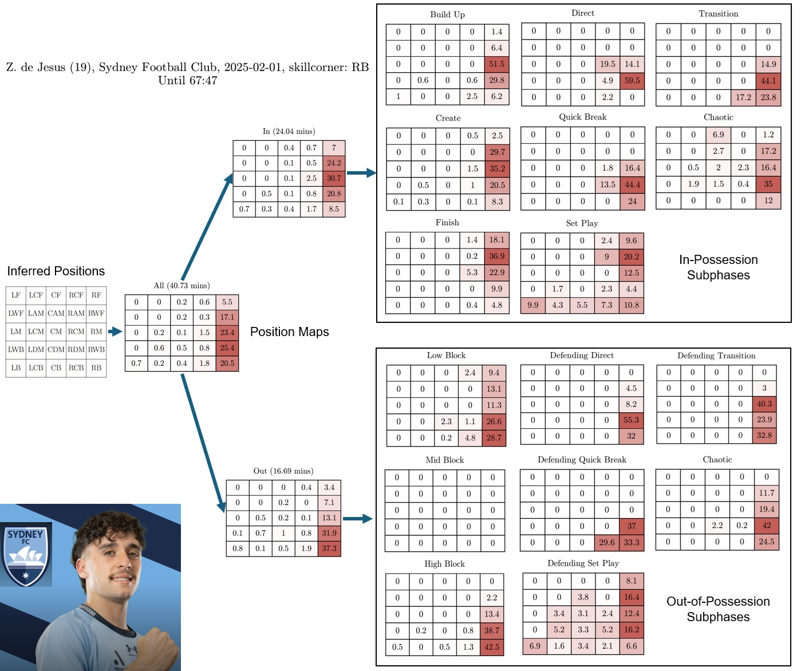
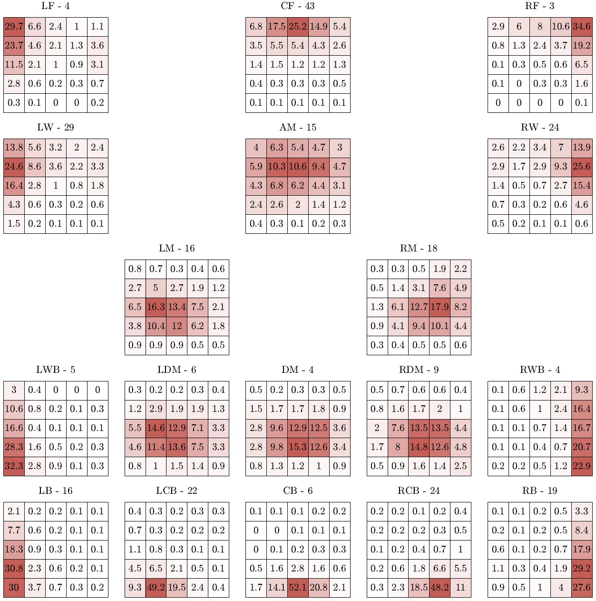

# SkillCorner X PySport Analytics Cup
This repository contains [Hadi Sotudeh](https://www.linkedin.com/in/hadisotudeh)'s submission for the SkillCorner X PySport Analytics Cup **Research Track**. 

## Positional Player Scouting with Tracking Data

### Introduction
Clubs like [Brighton](http://archive.trainingground.guru/articles/bulmer-appointed-as-brightons-scouting-boss-for-centre-backs) have shifted from geographically focused scouting (e.g., South America) to **positional scouting** (i.e., monitoring players by position such as center back). This work asks whether tracking data can be used to infer a player's tactical position across phases in a consistent, automated, and scalable way.

We propose a framework for **positional scouting using tracking data**, profiling players' positions over match time and across [phases of play](https://skillcorner.crunch.help/en/glossaries) to better contextualize performance. For versatile players (e.g., LW, AM, CF), identifying matches in which they occupy a target position supports video/data scouting, opposition analysis, and talent evaluation in academy settings.

### Methods
For each in-play tracking frame, we construct a **5×5 grid** around a team's outfield players, dividing width equally and length with weights `(0.5, 1, 1, 1, 0.5)` to account for positional outliers. Then, a player's **grid cell** represents instantaneous position relative to teammates. We calculate the **percentage of match time** each player occupies the 25 inferred positions and visualize this with **position maps**, where each cell reflects occupancy rate. 

For example, Zac De Jesus's **position map** from February 1, 2025, is initially hard to interpret because his movements span the entire right flank. SkillCorner's pre-tagged labels classified him as RB, but separating the map into **in-possession** and **out-of-possession** phases clarifies the picture: he acted as an RM with the ball and an RB without it. Breaking the maps down further by SkillCorner's subphases shows he operated as an RWF in Finish. For the **position maps** of other players. See [position_maps/players.pdf](position_maps/players.pdf).



After excluding late substitutions, which may introduce noise, we aggregated position maps of 267 players per pre-tagged [SkillCorner label](https://skillcorner.crunch.help/en/working-with-the-data/physical-data-glossary-1-1) to create **position templates** below, where the number of players per label is shown above each map. Overall, the templates are visually appealing, but the RDM, DM, and LDM appear indistinguishable, which could be alleviated with access to more tracking data.



We then create a **Nearest Neighbor classifier** employing [Hellinger distance](https://en.wikipedia.org/wiki/Hellinger_distance) to assign each player's position map to the closest template. As a result, we automate position assignment based on tracking data, eliminating reliance on human labels.

### Results
Comparing our assigned labels to SkillCorner positions shows **71% agreement**, as shown in [position_maps/matching.pdf](position_maps/matching.pdf). Deviations highlight players whose on-pitch behavior differs from SkillCorner's pre-determined tags, revealing cases of possible versatility (see [position_maps/cases.pdf](position_maps/cases.pdf)).

Finally, dimensionality reduction (MDS) projects position maps into 2D space, enabling visualization of spatial distributions and identification of unconventional positional profiles, see the interactive component in **submission.ipynb**.

### Conclusion
In this submission, we present a **positional scouting framework using tracking data**, moving beyond pre-tagged labels or event clustering to identify tactical positions. In the future, profiles can be refined by incorporating formation and game state (leading, trailing, or drawing) or by integrating players' spatial maps with on-ball actions (e.g., SkillCorner Dynamic Events) to identify **roles** (e.g., a poacher). In practical terms, this framework can support decision-making by enabling scouts and analysts to filter players.

## How to Run the Code

1. **Prerequisites**  
   Make sure Python **3** and `pip` are installed.

2. **Install Pipenv**  
   ```bash
   pip install pipenv
   ```

3. **Set up the environment**
   From the project root directory, run:

   ```bash
   pipenv install
   ```

4. **Open the notebook**
   Launch `submission.ipynb` and choose the Python kernel created by Pipenv.

5. **Run the workflow**
   Execute all notebook cells to download the raw SkillCorner data and generate the results in the `position_maps/` folder.
